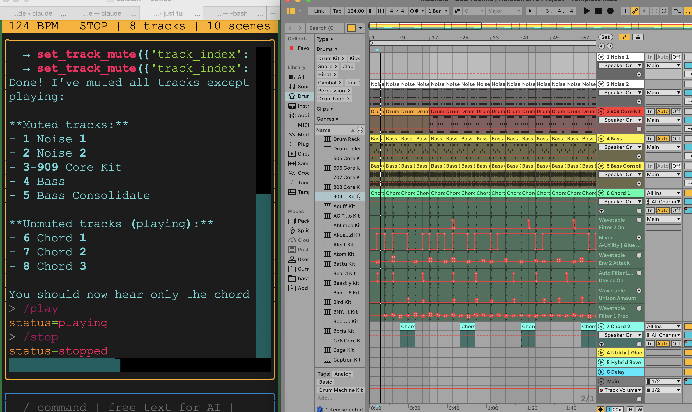

# margin-walker

AI agents for Ableton Live, built on [Google ADK](https://github.com/google/adk-python) and [AbletonOSC](https://github.com/ideoforms/AbletonOSC).

Three-agent pipeline that interprets music requests, executes production actions, and mixes — all through natural language.

```
Composer (Sonnet) → Producer (Sonnet) → Mixer (Haiku)
    plan               execute             mix
```

## Examples

From simple one-liners to complex production tasks — the agents figure out which tools to call.

### Basic — single tool calls

```
"mute the kick"
"set the tempo to 130"
"solo the 909"
"what tracks are in this set?"
"stop playback"
```

### Intermediate — multi-step operations

```
"send the hats to the reverb bus at about 30%"
  → finds the 909 track index
  → finds which return track is the reverb bus
  → sets send level to 0.3

"pan the three chord tracks hard left, center, and hard right"
  → identifies tracks 5, 6, 7 as chord tracks
  → sets panning to -1.0, 0.0, 1.0

"create a new MIDI track called 'Sub Bass' and arm it for recording"
  → creates MIDI track
  → renames it
  → arms it

"bypass all the effects on the noise tracks but keep the compressors"
  → identifies noise tracks (0, 1)
  → iterates devices on each
  → disables all except Compressor
```

### Advanced — compositional tasks

```
"write a four-on-the-floor kick pattern at 124bpm, 1 bar loop"
  → creates clip on the 909 track, scene 0, length 4.0
  → adds kick notes (pitch 36) at beats 0, 1, 2, 3
  → sets loop points

"add a dub chord stab on beat 2 and 4 — Cm7, velocity 70, short and staccato"
  → finds a chord track
  → creates clip
  → adds notes: C3, Eb3, G3, Bb3 at beats 1.0 and 3.0
  → duration 0.25 (sixteenth), velocity 70

"build an 8-bar arrangement: drums only for 4 bars, then bring in bass,
 then add chords at bar 6 with a filter sweep"
  → creates scenes for each section
  → duplicates/creates clips across scenes
  → unmutes tracks progressively per scene
  → adjusts Auto Filter parameters over the last 2 bars

"mix this like a Basic Channel record — everything dark and submerged,
 heavy reverb sends, roll off everything above 5k"
  → sets EQ Eight high shelf on all tracks around 5kHz
  → increases send levels to reverb bus (return B) to ~0.5-0.7
  → pulls master volume to 0.75
  → adjusts track volumes for depth: drums forward, chords way back
```

## TUI

Terminal UI for direct Ableton control — slash commands, keyboard shortcuts, and AI chat.



```bash
just tui
```

| Command | Alias | Description |
|---------|-------|-------------|
| `/play` | `/p` | Start playback |
| `/stop` | `/x` | Stop playback |
| `/tempo 128` | `/bpm` | Get/set tempo |
| `/mute kick` | `/m` | Mute track by name |
| `/solo 909` | `/s` | Solo track |
| `/vol bass 0.7` | `/v` | Set track volume |
| `/tracks` | `/ls` | List all tracks |
| `/fire 0` | `/f` | Fire scene |
| `/launch bass 2` | `/l` | Fire clip |
| `/devices chord1` | `/d` | List devices on track |
| `/status` | `/st` | Song info |
| `/help` | `/h` | All commands |

**Keyboard shortcuts:** F5 play, F6 stop, Ctrl+C quit

**Free text** (no `/` prefix) routes to the AI agent — same pipeline as `just run`.

Supports **unix-style pipes**: `/mute noise1 | /mute noise2 | /solo 909`

### Macros

Capture LLM tool sequences as instant slash commands — no cloud inference on replay.

```
> mute all tracks except the chords        ← LLM figures it out
> /save chords-mute                         ← capture those tool calls
> /chords-mute                              ← instant replay, no LLM
```

| Command | Description |
|---------|-------------|
| `/save <name>` | Save last LLM tool calls as a macro |
| `/macros` | List saved macros |
| `/macro-show <name>` | Show macro steps |
| `/macro-delete <name>` | Delete a macro |

Macros persist across sessions in `~/.margin-walker/macros.json`. See [MACROS.md](MACROS.md) for the full guide.

## Architecture

```
margin-walker/
├── ableton_adk/
│   ├── agents/          # Composer, Producer, Mixer
│   ├── tools/           # 53 OSC tools across 7 modules
│   │   ├── transport    # play, stop, tempo, time sig
│   │   ├── track        # create, arm, mute, solo, volume, pan
│   │   ├── clip         # create, add MIDI notes, fire, loop
│   │   ├── device       # parameters, enable/bypass
│   │   ├── scene        # create, fire, duplicate
│   │   ├── mixer        # master, returns, sends, crossfader
│   │   └── song         # info, quantization, groove
│   ├── tui/             # Textual terminal UI
│   │   ├── agents/      # Command + LLM routing
│   │   └── widgets/     # Status bar, command input
│   ├── prompts/         # Agent instructions
│   └── lib/
│       └── osc_client   # UDP client (send:11000, recv:11001)
├── AbletonOSC/          # Submodule (with custom master/return handlers)
├── ableton-config/      # Your API keys + agent instructions
└── docs/                # Integration research
```

### Custom AbletonOSC Extensions

We add two handlers missing from upstream AbletonOSC:

- **MasterTrackHandler** — `/live/master/get|set/{volume,panning,crossfader}`, device listing
- **ReturnTrackHandler** — `/live/return/get|set/{volume,panning,send}`, `/live/song/get/num_return_tracks`

## Setup

```bash
# 1. Clone with submodules
git clone --recurse-submodules https://github.com/tnn1t1s/margin-walker.git
cd margin-walker

# 2. Install
just setup

# 3. Configure
cp ableton-config.example/.env ableton-config/.env
# Edit ableton-config/.env with your OPENROUTER_API_KEY

# 4. In Ableton Live
# Preferences → Link/Tempo/MIDI → Control Surface: AbletonOSC

# 5. Verify connection
just check-osc
```

## Usage

```bash
# Full pipeline (Composer → Producer → Mixer)
just run

# Browser UI
just web

# Direct task to Producer agent
just task "create a 4-bar drum loop at 120bpm"
just task "add a bassline on track 2 using C2 and G1"
just task "set all chord tracks to 50% volume and pan them L/C/R"
```

### Python

```python
from ableton_adk.tools.track import get_track_names, set_track_volume
from ableton_adk.tools.transport import play, set_tempo
from ableton_adk.tools.clip import create_clip, add_notes

set_tempo(124.0)
create_clip(track_index=0, scene_index=0, length=4.0)
add_notes(0, 0, [
    {"pitch": 36, "start": 0.0, "duration": 0.5, "velocity": 100},  # kick
    {"pitch": 36, "start": 1.0, "duration": 0.5, "velocity": 100},
    {"pitch": 36, "start": 2.0, "duration": 0.5, "velocity": 100},
    {"pitch": 36, "start": 3.0, "duration": 0.5, "velocity": 100},
])
play()
```

## Requirements

- Ableton Live 11 or 12
- Python 3.12+
- [just](https://github.com/casey/just) command runner
- OpenRouter API key (for agent LLM calls)

## License

MIT
